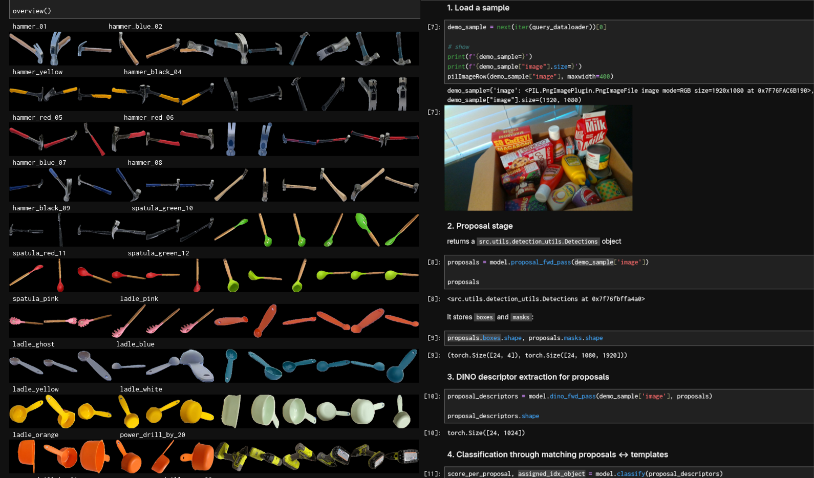

# cnos25
<a href="https://bop.felk.cvut.cz/leaderboards/modelfree-detection-unseen-bop24/bop-h3">
    
</a>

**Tempalate-based novel object detection and segmentation.**

---
cnos25 follows the [CNOS](https://github.com/nv-nguyen/cnos/) propose-then-match pipeline.
It uses YOLOE as the proposal model and dinov3 descriptors for matching.
It's [fast](https://bop.felk.cvut.cz/leaderboards/modelfree-detection-unseen-bop24/bop-h3).

Besides result reproduction, this repo might provide some useful code for you:
* Handling of Hot3D dataset  - which is a bit tricky with its two rgb/gray streams, Aria/Quest3 devices and clip_utils dependency
* Evaluation tools - which help you to keep track of your experiments
* Visualization tools and demos - nice to get started

---

## 🔧 Setup

### Installation
Install the project and its dependencies:
```commandline
conda create -n cnos25 python=3.10
conda activate cnos25
pip install -e .
```

### Checkpoints
All paths you need to set up are in [configs/local.yaml](configs/local.yaml).
1. yoloe-11l-seg:
[Download](https://github.com/ultralytics/assets/releases/download/v8.3.0/yoloe-11l-seg.pt). Set `yoloe_checkpoint:` in `local.yaml`.
2. dinov3 ViT-L/16:
   1. [Download](https://ai.meta.com/resources/models-and-libraries/dinov3-downloads/). Set `dinov3_checkpoint:` in `local.yaml`. 
      
   2. [Clone](https://github.com/facebookresearch/dinov3). Set `dinov3_repo:` in `local.yaml`.


### Datasets
Currently, the three datasets in BOP-H3 are explicitly supported.
When [downloading](https://bop.felk.cvut.cz/datasets/), you can skip all training folders as cnos is training-free and makes no use of them.
You can refer to [this script](https://github.com/nv-nguyen/cnos/blob/main/src/scripts/download_modelfree_onboarding_bop_h3.py) for downloading, unzipping and renaming.

<details><summary>File Tree</summary>

```bash
bop_data_root/
├── handal/
│   ├── test_metaData.json
│   ├── test_targets_bop24.json
│   ├── onboarding_static
│   │   ├── obj_00000xx/
│   │   └── ...
│   ├── val/
│   │   ├── 000001/
│   │   └── ...
│   ├── test/
│   │   ├── 000011/
│   │   └── ...
│   └── ...
├── hopev2/
│   └──  same as handal
├── hot3d/
│   ├── clip_definitions.json
│   ├── clip_splits.json
│   ├── test_targets_bop24.json
│   ├── onboarding_static/ # -> object_ref_aria_static 
│   │   ├── obj_00000xx
│   │   └── ...
│   ├── test_aria/
│   │   ├── clip-003xxx.tar
│   │   └── ...
│   ├── test_quest3/
│   │   ├── clip-001xxx.tar
│   │   └── ...
└── └── ...
```

</details>

After downloading, set `bop_data_root:` in `local.yaml`.

## 🚀 Quick start

Check out the [onboarding notebook](onboarding_demo.ipynb) and the [inference notebook](inference_demo.ipynb):


## ▶️ Full run
Following the [BOP workflow](https://bop.felk.cvut.cz/static/img/6d_object_pose_estimation.jpg), there are two stages,
onboarding and inference.

###  1. Onboarding Stage
Extract the reference (=template) descriptors from the onboarding data:
```commandline
python -m src.scripts.extract_template_descriptors dataset_name=hopev2
```
The corresponding config file is [extract_templates.yaml](configs/extract_templates.yaml).

<details><summary>cache path</summary>

Descriptors are stored by default in `onboarding_static/descriptors` of the selected dataset.
The default output file name is `${model_name}_descriptors.pt`.
Change it by passing `out_file=foo.pt`.

</details>

### 2. Inference Stage
Predict boxes and segmentations: 
```commandline
python run_inference.py dataset_name=hopev2 split=test
```
The corresponding config file is [run_inference.yaml](configs/run_inference.yaml).

<details><summary>auto-downloads</summary>

On the first run, ultralytics will automatically install a package `clip` and download `mobileclip_blt.ts` (572MB),
which are required for textual prompting of YOLOE.

</details>

<details><summary>Measure AP on validation split</summary>

If you pass `split=val`, resulting AP is directly measured since ground truth is available for the validation set.
This requires two setup steps:
1. Since this invokes the [bop toolkit script](https://github.com/thodan/bop_toolkit/blob/master/scripts/eval_bop22_coco.py),
`git clone https://github.com/thodan/bop_toolkit/` and set `bop_toolkit_repo:` in [local.yaml](configs/run_inference.yaml).
2. Copy the respective `val_targets_bop24.json` from [val_targets/](val_targets) into your `{bop_data_root}/{dataset_name}`.

</details>

<details><summary>bop_toolkit troubleshooting</summary>

* `datetime.UTC` error in `bop_toolkit_lib/misc.py` - Fix: Change to `datetime.timezone.utc` [#203](https://github.com/thodan/bop_toolkit/commit/b9fefca50e7cf79a007d9e1603888f127fe12fac).
* `COCO` error in `scripts/eval_bop22_coco.py` - Fix: Replace `cocoGt = COCO(dataset_coco_ann)` with:
    ```python 
    _f='/tmp/dataset_coco_ann.json'
    with open(_f,'w') as f:
        json.dump(dataset_coco_ann, f)
    cocoGt = COCO(_f)
    ```
Reason: Deprecated calls to `datetime` and `pycocotools` in `bop_toolkit_lib`.

</details>

<details><summary>hydra troubleshooting</summary>

1. Make sure you have all paths correctly set in `local.yaml`.
2. You can override all config params from CLI. For example, if there are issues during template extraction, you can have a fast test run with only 6 instead of 100 samples per object:
    ```
    python -m src.scripts.extract_template_descriptors data.reference_dataloader.num_imgs_per_obj=6 out_file=dummy.pt dataset_name=...
    ```
3. Instead of running everything as a single python script, run modularly using our provided [notebooks](). It might be easier to spot the exact issue there.

</details>


## Acknowledgement
The code is adapted from [CNOS](https://github.com/nv-nguyen/cnos/). The two models used are
[YOLOE](https://github.com/THU-MIG/yoloe/) and [dinov3](https://github.com/facebookresearch/dinov3/).

## Contact
If you have any question or feature request, feel free to create an issue or contact me at jherzog@zju.edu.cn.
